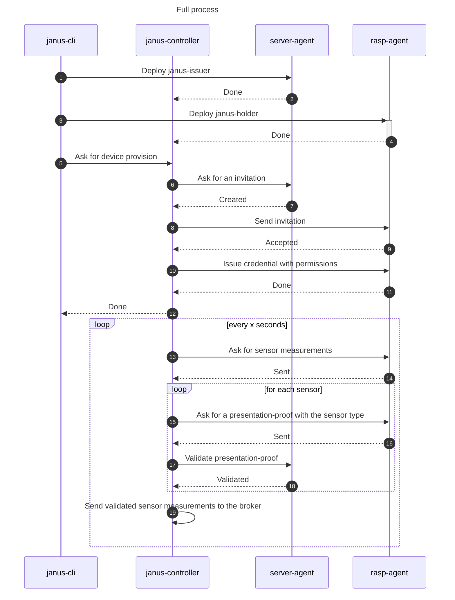

# Janus

Janus uses [Verifiable Credentials](https://www.w3.org/TR/vc-data-model/) to add a new security layer over IoT devices and MQTT brokers. Providing a way to deploy and manage Aries agents on Iot Devices Through a CLI and ACA-py agents.

A Credential is issued to the IoT device with a list of sensors it is allowed to export data and a presentation proof of this credential is required before every sensor data transmission to the broker.


## Table of Contents

1. [Janus](#Janus)
2. [Workflow](#Workflow)
3. [Usage](#Usage)
    1. [Issuer and Controller](#Deploy-an-issuer-agent-and-janus-controller)
    2. [Single Holder](#Deploy-a-holder-agent-on-IoT-device)
    3. [Multiple holders](#Deploy-multiple-hosts-by-config-file)
4. [Development](#Development)
## Workflow

The main workflow is based on three steps. The manual deploy of the agents usign the CLI, the device provisioning, where the credentials will be issued and the sensor measurement with presentations proofs where the data is sent to the mqtt broker.


## Usage

> _**Important**_: Having Docker either in the host machine and IoT device is the only installation requirement of Janus.

### Deploy an issuer agent and janus-controller

```cmd
janus-cli deploy issuer 
``` 

### Deploy a holder agent on IoT device

> _**Note:**_ A previously configured [SSH key authentication](https://www.digitalocean.com/community/tutorials/how-to-set-up-ssh-keys-2) between the host and IoT device is required for this step. 

```cmd
janus-cli deploy holder -H pi@192.168.0.1
``` 

```http
POST http://localhost:8081/provision HTTP/1.1
content-type: application/json

    {
        "deviceHostName": "pi@192.168.0.6",
        "permissions": ["temperature", "humidity"],
        "brokerIp": "192.168.0.12",
        "brokerUsername": "admin:e72928",
        "brokerPassword": "admin"
    }
```

### Deploy multiple hosts by config file

```yaml

default: # Default values will be set on agents blank fields.
  sensors:
  - temperature
  - humidity
  broker:
    ip: "127.0.0.1"
    username: "admin"
    password: "admin"
agents:
  - hostname: pi@192.168.0.1
    sensors:
      - humidity
    broker:
      id: "800a9f"
  - hostname: pi@192.168.0.2
    broker:
      id: "e72928"
```

```cmd
janus-cli deploy holder -F ./agents.yaml -p
```
> -p refers to auto-provisioning if the janus-controller is already running 

### Need more help using it? 
For more details about the CLI use -h flag to get some help:

```cmd
janus-cli -h
janus-cli deploy -h
```
## Development

Janus was developed usign go 1.20, Docker 20.10.24 and relies over ACA-py agents and docker automation. For diagrams and more details about the implementation, check [here](./docs/implementation.md).

Before starting working it's required to run 	``` go generate ./... ``` so the docker files will be copied to the corresponding directories, required for the docker automation.

For building the application use Make with the command ```make build-cli```. This will generate binaries for linux, mac and windows on /bin folder. 
